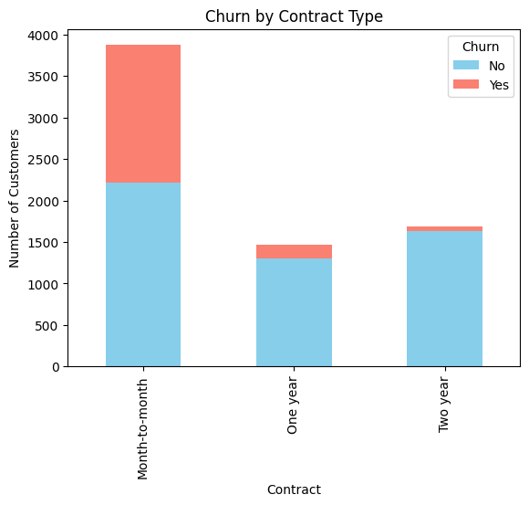
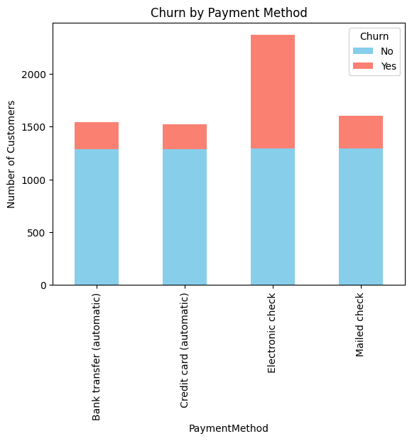
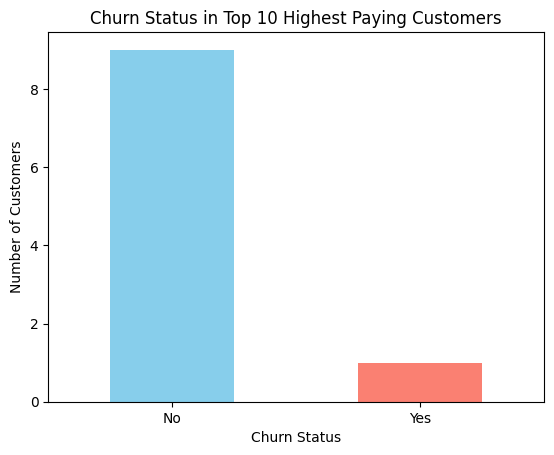

# Telco-Customer-Churn-Analysis
SQL project analyzing Telco customer churn data with Kaggle dataset

# Telco Customer Churn Analysis (SQL + Python)

This project analyzes the **Telco Customer Churn** dataset (Kaggle) using SQL inside Google Colab to identify churn drivers and business actions.

**Dataset:** https://www.kaggle.com/datasets/blastchar/telco-customer-churn

## What I did
- Cleaned data with Pandas (converted `TotalCharges`/`MonthlyCharges` to numeric).  
- Loaded cleaned data into SQLite and ran SQL queries (`SELECT`,`GROUP BY`, `MAX`, `AVG`, `COUNT`, etc.).  
- Produced charts to visualize contract, payment method, and churn patterns.

## Key findings
- Overall churn: **26.5%**.  
- Higher churn: seniors, month-to-month contracts, fiber optic users, electronic-check payers.  
- Lost revenue from churn: ~ \$139K/month (~ \$1.6M/year).

## Visual Insights

### Churn by Contract Type

### Churn by Payment Method

### Churn Status in Top 10 Highest Paying Customers

## How to run
1. Open `Telco_Churn_SQL.ipynb` in Google Colab (or run locally).  
2. Upload the dataset when prompted (download it from Kaggle link above).  
3. Run cells from top → bottom.

## Files
- `Telco_Churn_SQL.ipynb` — Colab notebook (cleaning, SQL queries, plots).  

## Author
👤 Jannatul Aisyah  
🎓 Applied Statistics | Aspiring Data Analyst  
📌 [LinkedIn](linkedin.com/in/jannatulaisyahh)

